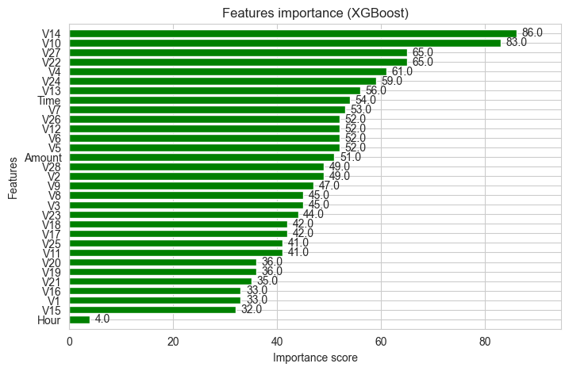
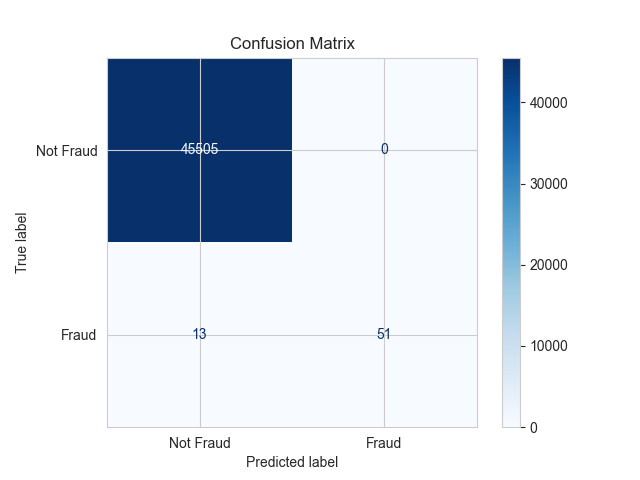

# 💳 Credit Card Fraud Detection Analysis

Este proyecto presenta un análisis exploratorio y visual de datos de transacciones de tarjetas de crédito, enfocándose en la detección de fraudes. A continuación se detallan las gráficas generadas y su propósito dentro del análisis.

---

## 📊 Visualizaciones

### 1. **Distribución de Clases**
[🔗 Ver gráfica interactiva: Class Distribution](https://github.com/LuisBuruato/FRAUD_CREDIT_CARD/blob/main/images/class_distribution.html)
Muestra el desbalance de clases entre transacciones legítimas (0) y fraudulentas (1).

---

### 2. **Distribución Temporal de Transacciones**

Gráfico de densidad que ilustra la distribución de las transacciones según el tiempo (en segundos). Se comparan las clases fraude y no fraude.

---

### 3. **Monto Total por Hora**

Comparativa del monto total transaccionado por hora entre transacciones normales y fraudulentas.

---

### 4. **Monto Máximo por Hora**

Visualización del valor máximo transaccionado por hora, separando transacciones legítimas y fraudulentas.

---

### 5. **Boxplots del Monto**

Comparación del monto de las transacciones con y sin valores atípicos, clasificados por tipo de transacción (fraudulenta o no).

---

### 6. **Fraudes por Tiempo vs Monto**

Dispersión de las transacciones fraudulentas según el tiempo y el monto.

---

### 7. **Mapa de Calor de Correlaciones**

Matriz de correlación entre todas las variables numéricas. Útil para entender relaciones entre atributos.

---

### 8. **Relación entre Variables y Monto**
  

Visualización de regresión para analizar la relación entre variables V20/V7 y el monto de transacción.

---

### 9. **Distribución KDE por Feature**

Gráfica de densidad para cada variable del dataset comparando fraudes y no fraudes. Ayuda a identificar patrones relevantes.

---

### 10. **Importancia de Variables (Modelo XGBoost)**

Importancia de las variables más relevantes según el modelo XGBoost.

---

### 11. **Matriz de Confusión**

Evaluación del rendimiento del modelo de clasificación.

---

## 🗂 Archivos
- `notebook.ipynb`: análisis completo.
- `images/`: todas las gráficas del análisis.
- `.gitignore`: configurado para ignorar archivos pesados como `creditcard.csv`.

---

## 📌 Notas
El archivo `creditcard.csv` fue eliminado del repositorio debido a su tamaño (>100MB). Si necesitas trabajar con los datos, puedes descargarlo desde [Kaggle](https://www.kaggle.com/datasets/mlg-ulb/creditcardfraud).

---

## ✍ Autor
Luis Buruato – [GitHub](https://github.com/LuisBuruato)
