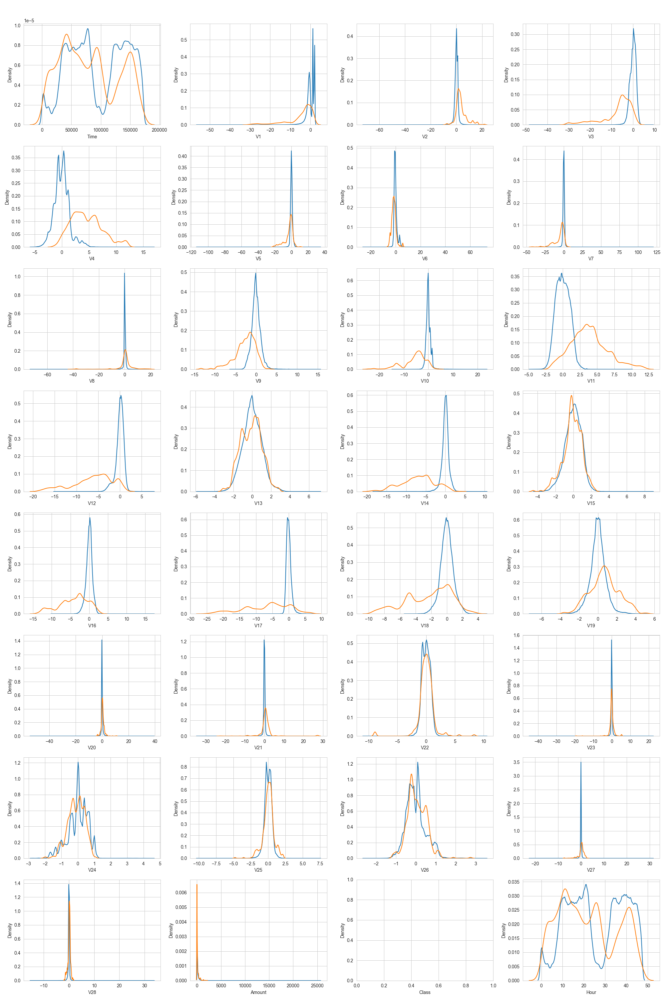
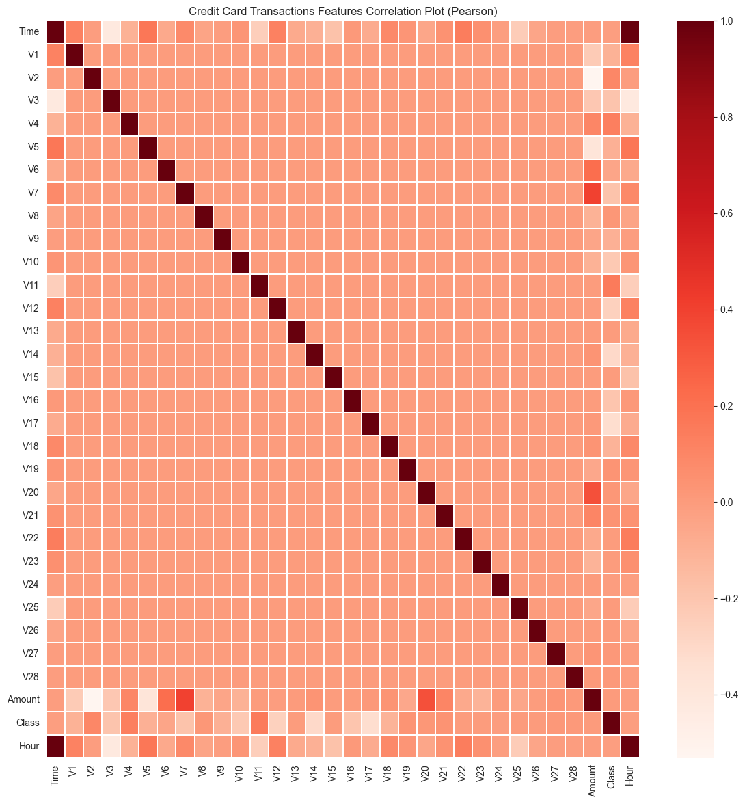
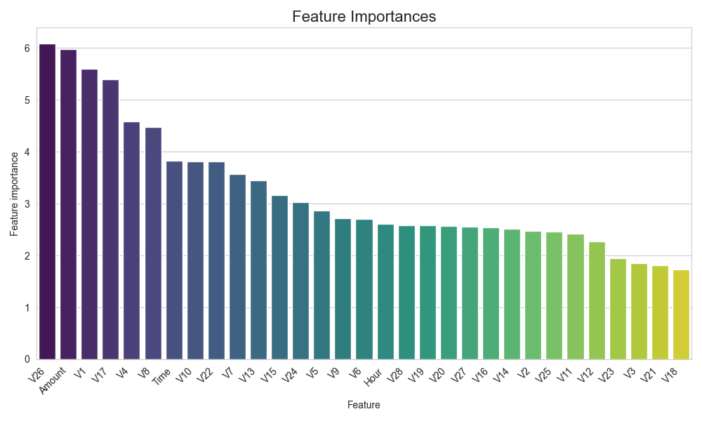
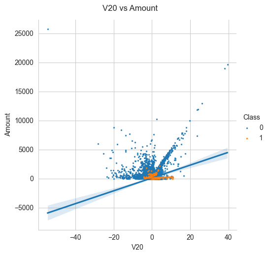
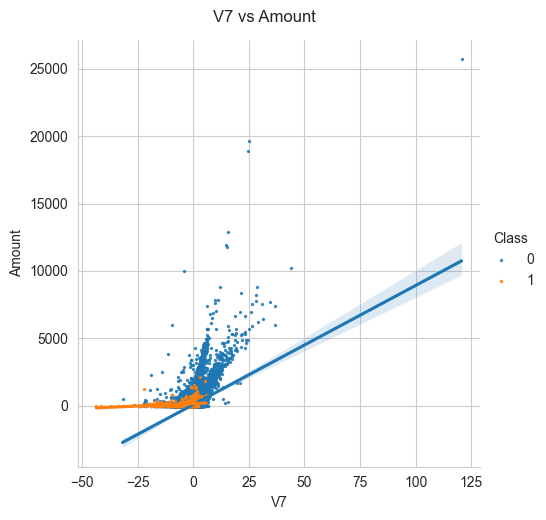

# 💳 Credit Card Fraud Detection - Visualización de Resultados

Este proyecto tiene como objetivo identificar transacciones fraudulentas utilizando técnicas de análisis de datos y aprendizaje automático. A continuación se presentan las visualizaciones clave generadas durante el análisis. Estas gráficas permiten entender mejor los patrones presentes en los datos y el rendimiento del modelo de detección.

---

## 📌 Gráficas Incluidas

### 1. 📊 Matriz de Confusión

> Esta matriz compara las predicciones del modelo con los valores reales.  
> - **True Negatives (TN)**: Transacciones legítimas correctamente clasificadas.  
> - **False Positives (FP)**: Transacciones legítimas clasificadas como fraude.  
> - **False Negatives (FN)**: Transacciones fraudulentas no detectadas.  
> - **True Positives (TP)**: Fraudes correctamente identificados.

Una matriz balanceada con un alto número de verdaderos positivos y negativos indica un buen rendimiento del modelo.

---

### 2. 📈 Distribución de Variables por Clase

> Muestra la densidad de cada variable del dataset, separadas por clase (`0` = No fraude, `1` = Fraude).  
> Permite observar qué variables presentan diferencias significativas en su distribución, lo cual es útil para la selección de características.

---

### 3. 🔥 Correlación entre Variables

> Mapa de calor (heatmap) de correlación entre todas las variables del conjunto de datos.  
> Ayuda a identificar relaciones lineales fuertes entre variables, lo cual puede afectar ciertos modelos o ser aprovechado para ingeniería de características.

---

### 4. 💡 Importancia de Variables (Modelo Base)

> Muestra qué variables fueron más relevantes para el modelo.  
> Una alta importancia significa que esa variable tiene mayor poder predictivo para clasificar correctamente las transacciones.

---

### 5. 🔍 lmplot V20 vs Amount

> Gráfico de dispersión con regresión lineal de la variable `V20` respecto al monto de transacción (`Amount`).  
> Diferenciado por clase (color), se pueden observar posibles patrones distintos entre transacciones fraudulentas y no fraudulentas.

---

### 6. 🔍 lmplot V7 vs Amount

> Similar al anterior, muestra la relación entre `V7` y `Amount`.  
> Permite identificar si existe una correlación lineal útil para distinguir entre clases.

---

### 7. 🌲 Importancia de Características - XGBoost

> Visualiza la importancia de las variables calculada por el modelo **XGBoost**, uno de los algoritmos más potentes para clasificación.  
> Variables con mayor puntuación fueron clave en la toma de decisiones del modelo.

---

## 📌 Conclusión

Estas visualizaciones permiten:

- **Comprender mejor la naturaleza del dataset**, incluyendo la distribución de variables y su relevancia para la predicción de fraude.
- **Evaluar el rendimiento del modelo**, principalmente a través de la matriz de confusión.
- **Identificar variables clave** que podrían utilizarse en futuras optimizaciones o como parte de una explicación interpretable del modelo.

La combinación de gráficos estadísticos y modelos explicativos como XGBoost brinda una visión completa del proceso de detección de fraude.

---

## 👨‍💻 Autor

**Luis Buruato**  
📧 luisburuato@gmail.com  
🔗 [GitHub](https://github.com/LuisBuruato)
¿Quieres que te lo guarde como archivo README.md listo para subir al repositorio?

Ask ChatGPT

